# Первичные требования к метрикам в Superset

* * *

| Метрики собираются по командам - команды находятся внутри направления.  Команды ведут свою деятельность в виде спринтов. Длительность спринтов - 2 недели. |                                                                                                                                                                                                                                                                                                                                                                                                                                                                                                                                                                                                                                                                                                                                                                                                                                                                                                                                                                                                                                                                                   |                                                                                                                                                                                                                                                                                                                                                                                                                                                                                                                                                                                                                                                           |                                                                                                                                                                                                                                                                                                                                                                                 |
| ---------------------------------------------------------------------------------------------------------------------------------------------------------------- | --------------------------------------------------------------------------------------------------------------------------------------------------------------------------------------------------------------------------------------------------------------------------------------------------------------------------------------------------------------------------------------------------------------------------------------------------------------------------------------------------------------------------------------------------------------------------------------------------------------------------------------------------------------------------------------------------------------------------------------------------------------------------------------------------------------------------------------------------------------------------------------------------------------------------------------------------------------------------------------------------------------------------------------------------------------------------------- | --------------------------------------------------------------------------------------------------------------------------------------------------------------------------------------------------------------------------------------------------------------------------------------------------------------------------------------------------------------------------------------------------------------------------------------------------------------------------------------------------------------------------------------------------------------------------------------------------------------------------------------------------------- | ------------------------------------------------------------------------------------------------------------------------------------------------------------------------------------------------------------------------------------------------------------------------------------------------------------------------------------------------------------------------------- |
| Метрика                                                                                                                                                          | Описание                                                                                                                                                                                                                                                                                                                                                                                                                                                                                                                                                                                                                                                                                                                                                                                                                                                                                                                                                                                                                                                                          | Дополнительные требования                                                                                                                                                                                                                                                                                                                                                                                                                                                                                                                                                                                                                                 | Потенциальные необходимые данные из Kaiten                                                                                                                                                                                                                                                                                                                                      |
| Распределение потока начало спринта                                                                                                                              | Доля различных типов задач (bug, user story, enabler user story, support) на 1й-2й день начала спринта в количественном и процентом виде на всех статусах, начиная со статуса "Бэклог спринта" включительно.  Пример табличного вида и диаграммы  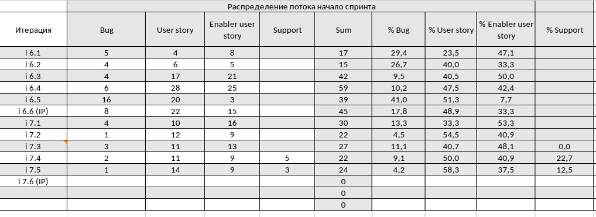      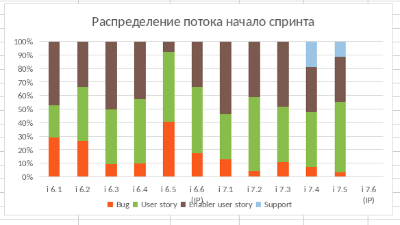      Чтобы получить **процентное соотношение карточек** по типам, необходимо воспользоваться формулой:  (Часть / Целое) \* 100 = Процентное соотношение.  Пример: общее кол-во карточек в спринте 22. Карточек типа support 5. По формуле: 5/22\*100=22.7. 22.7 - процентное соотношение карточек типа support к общему кол-ву карточек в спринте.                                                                                                                                                                                                                                                                                                                           | Метрика собирается на 1-2й день спринта.      Статистика нужна по датам (выбор отдельного дня/дней/дней спринта).  Следить за метрикой необходимо в динамике, кратной дню (любой дате) с возможностью вывода количества элементов (кол-ва карточек по типам) в выбранном периоде.      **Требования**:  По умолчанию необходимо выводить информацию по спринтам.  Пользователь может выбрать период дат для вывода информации.                                                                                                                                                                                  | Информация о карточке:  *   Принадлежность карточки к спринту *   Дата создания *   Тип карточки      Информация о спринте  *   Дата начала спринта      *   Принадлежность карточки к определённой команде                                                                                                                           |
| Распределение потока конец спринта                                                                                                                               | Доля различных типов задач (bug, user story, enabler user story, support) на последний день спринта в количественном и процентом виде, начиная со статуса "Бэклог спринта" включительно.  Пример табличного вида и диаграммы  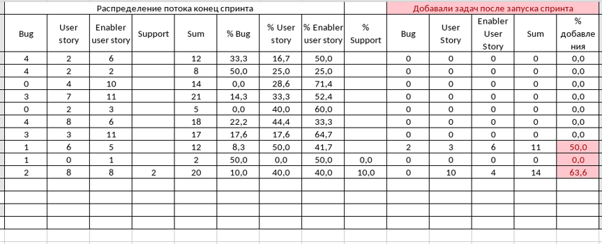      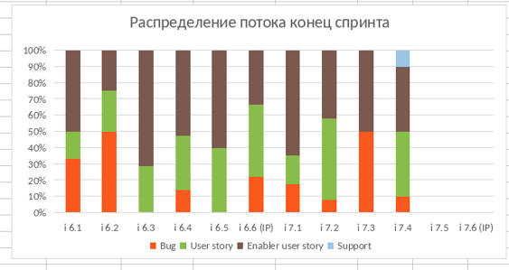          Чтобы получить **процентное соотношение карточек** по типам, необходимо воспользоваться формулой:  (Часть / Целое) \* 100 = Процентное соотношение.  Пример: общее кол-во карточек в спринте 22. Карточек типа support 5. По формуле: 5/22\*100=22.7. 22.7 - процентное соотношение карточек типа support к общему кол-ву карточек в спринте.                                                                                                                                                                                                                                                                                                                                      | Метрика собирается в последний день спринта.  Необходимо учитывать карточки спринта в архиве.  Так же, при подсчёте необходимо **отдельно** учитывать карточки, которые были добавлены после запуска спринта.      **Требования**:  Статистика нужна по датам (выбор отдельного дня/дней/дней спринта).  Следить за метрикой необходимо в динамике, кратной дню (любой дате) с возможностью вывода количества элементов (кол-ва карточек по типам) в выбранном периоде.      По умолчанию необходимо выводить информацию по спринтам.  Пользователь может выбрать период дат для вывода информации. | Информация о карточке:  *   Принадлежность карточки к спринту *   Тип карточки      Информация о спринте  *   Дата начала спринта *   Дата окончания спринта      *   Принадлежность карточки к определённой команде                                                                                                                  |
| Скорость потока                                                                                                                                                  | Количество задач в статусе "Завершён" (колонка типа "Готово") за период времени.  Пример табличного вида и диаграммы  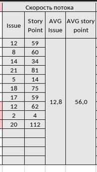      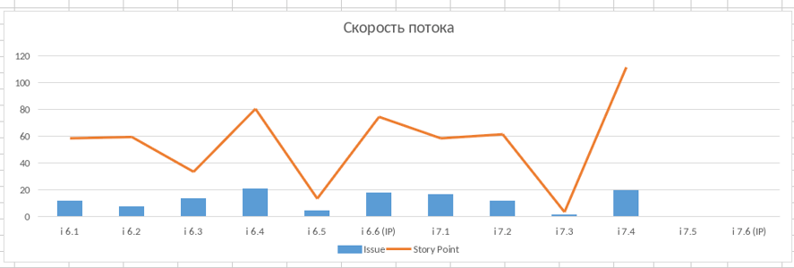          Для построения колонки **Issue** необходимо посчитать кол-во карточек каждого типа в статусе "Завершён" (колонка типа "Готово").      Для построения колонки **Story Point** необходимо найти сумму оценок из кастомного поля карточки "Размер" по типам карточек.      Для построения колонки **AVG Issue** необходимо найти среднее арифметическое Issue за 3 прошедших спринта, включая актуальный завершённый.  **Формула** расчёта **AVG Issue**: (issue 1 + issue 2 + issue 3) / 3 = AVG Issue      Для построения колонки **AVG story point** необходимо найти среднее арифметическое story point за 3 прошедших спринта, включая актуальный завершённый.  **Формула** расчёта AVG story point: (sp 1 + sp 2 + sp 3) / 3 = AVG story point    | Метрика собирается в последний день спринта.  Необходимо учитывать карточки спринта в архиве.  Так же, при подсчёте необходимо учитывать карточки, которые были добавлены и выполнены после запуска спринта.      **Требования**:  Метрику считать необходимо через дату завершения задачи.  Пользователь может выбрать период дат для вывода информации.                                                                                                                                                                                                                                                             | Информация о карточке:  *   Принадлежность карточки к спринту *   Тип карточки *   Нахождение карточки в статусе "Завершён" (колонка типа "Готово"). *   Кастомное поле карточки "Размер"      Информация о спринте  *   Дата начала спринта *   Дата окончания спринта      *   Принадлежность карточки к определённой команде |
| Время потока                                                                                                                                                     | Время от создания задачи до даты её выполнения.  Пример табличного вида и диаграммы  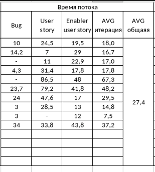      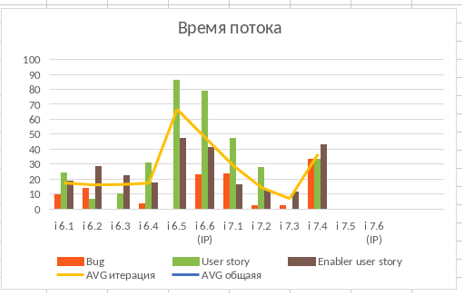      **Формула** выполнения подсчёта для колонки **для типов карточек**:  Дата выполнения (т.е. попадания в статус "Готово") - (минус) Дата создания карточки = значение времени потока для конкретного типа карточек.      Для построения колонки **AVG итерация** необходимо воспользоваться **формулой**:  Значения времени потока каждого типа карточек сложить и разделить на кол-во слагаемых значений = AVG итерации      Для построения колонки **AVG общая** необходимо воспользоваться **формулой**:  Значения всех AVG итерация сложить и разделить на кол-во слагаемых значений = AVG общая                                                                                                                                                                                                     | Метрика собирается в последний день спринта.  Необходимо учитывать карточки спринта в архиве.  Так же, при подсчёте необходимо учитывать карточки, которые были добавлены и выполнены после запуска спринта.      **Требования**:  В таблице и на графике отображать метрику необходимо в днях.  Собирать метрику необходимо по типам карточек и по командам.  Пользователь может выбрать период дат для вывода информации.                                                                                                                                                                                     | Информация о карточке:  *   Принадлежность карточки к спринту  *   Тип карточки  *   Время и дата создания карточки *   Время и дата выполнения задачи      Информация о спринте  *   Дата начала спринта *   Дата окончания спринта      *   Принадлежность карточки к определённой команде                              |
| Загрузка потока                                                                                                                                                  | Общее количество карточек на всех статусах, кроме статуса "Завершён" (колонка типа "Готово").  Пример табличного вида и диаграммы  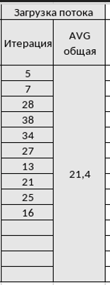      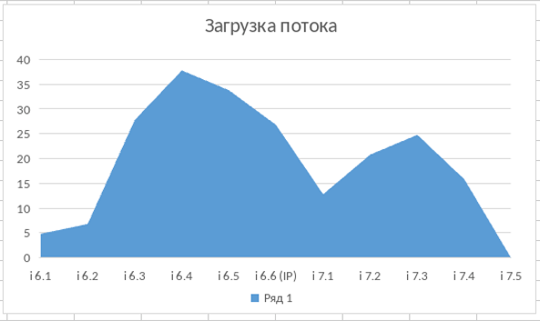      Для колонки Итерация необходимо сложить все карточки на всех статусах, кроме статуса "Завершён" (колонка типа "Готово").      Для построения колонки **AVG общая** необходимо воспользоваться **формулой**:  Все значения колонки Итерация сложить и разделить на кол-во слагаемых значений = AVG общая                                                                                                                                                                                                                                                                                                                                                                                                                                                                           | Метрика собирается в последний день спринта.  Необходимо учитывать карточки спринта в архиве.  Так же, при подсчёте необходимо учитывать карточки, которые были добавлены после запуска спринта.      **Требования**:  Период кратен дню.  Необходимо видеть кол-во элементов на текущий день.  Пользователь может выбрать период дат для вывода информации.                                                                                                                                                                                                                                                    | Информация о карточке:  *   Принадлежность карточки к спринту  *   Тип карточки  *   Нахождение карточки **НЕ** в статусе "Завершён" (колонка типа "Готово").      Информация о спринте  *   Дата начала спринта *   Дата конца спринта      *   Принадлежность карточки к определённой команде                              |
| Эффективность потока                                                                                                                                             | Необходимо собирать эффективность потока каждой карточки каждого типа из "Истории карточки" по всем статусам в периоде дат (попадание в диапазон дат начала и окончания спринта, статуса "Завершён" (колонка типа "Готово"))  Пример табличного вида и диаграммы  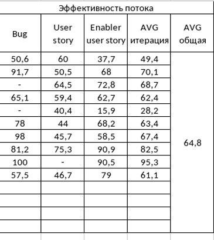      Для построения колонки **AVG итерация** необходимо воспользоваться **формулой**:  Значения времени потока каждого типа карточек сложить и разделить на кол-во слагаемых значений = AVG итерации      Для построения колонки **AVG общая** необходимо воспользоваться **формулой**:  Все значения колонки Итерация сложить и разделить на кол-во слагаемых значений = AVG общая                                                                                                                                                                                                                                                                                                                              | Метрика собирается в последний день спринта.  Необходимо учитывать карточки спринта в архиве.  Так же, при подсчёте необходимо учитывать карточки, которые были добавлены и выполнены после запуска спринта.      **Требования**:  Время, которое карточка провела в работе и в ожидании в разрезе периода дат.  Пользователь может выбрать период дат для вывода информации.                                                                                                                                                                                                                                         | Информация о карточке:  *   Принадлежность карточки к спринту  *   Тип карточки  *   Суммарное время в работе (даты) *   Суммарное время ожидания (не в работе) (даты)      Информация о спринте  *   Дата начала спринта *   Дата окончания спринта      *   Принадлежность карточки к определённой команде              |
| Прогнозируемость потока                                                                                                                                          | Количество запланированных задач, количество выполненных задач и процентное отношение плана к выполненному.  Пример табличного вида и диаграммы  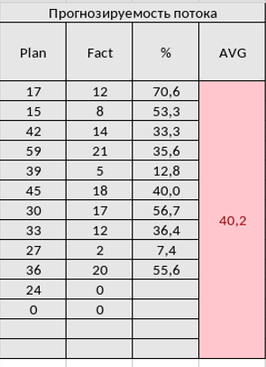      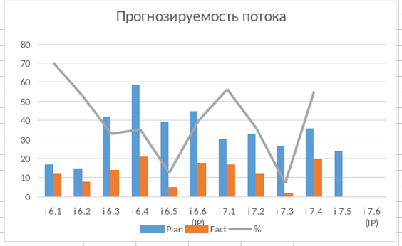      Для **построения** колонки **Plan** необходимо посчитать все задачи на всех статусах на начало спринта + учесть добавленные во время спринта задачи      Для **построения** колонки **Fact** необходимо посчитать все задачи в статусе "Завершён" (колонка типа "Готово") на конец спринта.      Для **построения** колонки **%** необходимо воспользоваться **формулой**:  Fact / Plan \* 100 = процентное отношение выполненного к запланированному      Для **построения** колонки **AVG** необходимо воспользоваться **формулой**:  Все значения колонки Итерация сложить и разделить на кол-во слагаемых значений = AVG                                                                                                         | Метрика собирается в 1-2й и последний день спринта, перед его закрытием.  Необходимо учитывать карточки спринта в архиве.  Так же, при подсчёте необходимо учитывать карточки, которые были добавлены и выполнены после запуска спринта, после 1-2го дня.  Пользователь может выбрать период дат для вывода информации.                                                                                                                                                                                                                                                                                                                 | Информация о карточке:  *   Тип карточки  *   Карточки **НЕ** в статусе "Завершён" (колонка типа "Готово"). *   Карточки в статусе "Завершён" (колонка типа "Готово")      Информация о спринте  *   Дата начала спринта *   Дата окончания спринта      *   Принадлежность карточки к определённой команде                     |